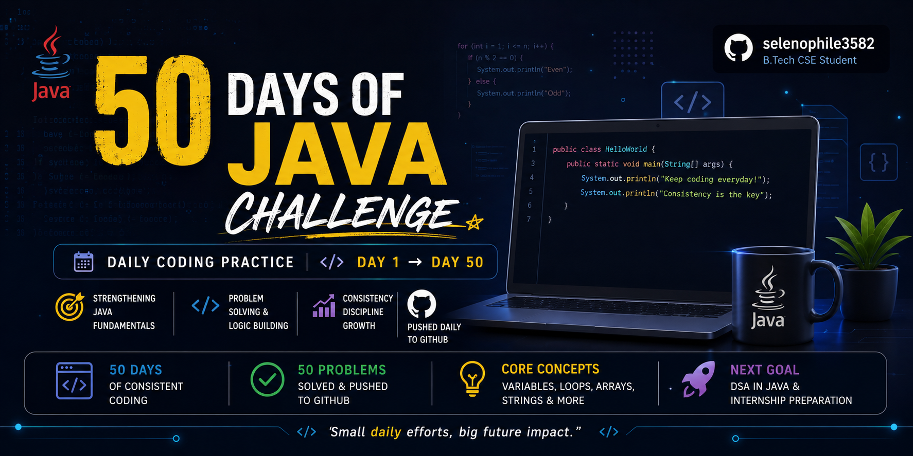

<p align="center">
  
</p>


# 🚀 50 Days of Java Challenge

## About the Challenge

Welcome to my **50 Days of Java Challenge** repository!

This repository contains my journey of solving and pushing Java programs daily to GitHub. Initially, I planned to complete a **30-day challenge**, but after developing consistency and enjoying the learning process, I extended it to **50 days**.

The primary goal of this challenge was to strengthen my understanding of **Java syntax and fundamentals** so that I could confidently move on to **Data Structures and Algorithms (DSA)** without struggling with the language itself.

---

## 🎯 Objectives

* Build a strong foundation in Java.
* Improve logical thinking and problem-solving skills.
* Develop a habit of coding consistently.
* Practice using Git and GitHub daily.
* Gain confidence before starting DSA.

---

## 📚 Topics Covered

Throughout this challenge, I practiced programs related to:

* Variables and Data Types
* Operators
* Conditional Statements
* Loops
* Functions / Methods
* Arrays
* Strings
* Pattern Printing
* Number-based Problems
* Basic Problem Solving

---

## 📂 Repository Structure

```text
Day01/
Day02/
Day03/
...
Day50/
```

Each folder contains the solution(s) for that day's practice.

---

## 🛠 Technologies Used

* Java
* Git
* GitHub

---

## 💡 Key Learnings

* Consistency is more important than motivation.
* Daily practice significantly improves programming skills.
* Repeated coding builds familiarity with syntax.
* Debugging skills improve naturally through practice.
* Small daily efforts compound over time.

---

## 📈 Challenge Outcome

✅ Successfully completed 50 days of consistent coding.

✅ Strengthened Java fundamentals.

✅ Built a daily coding habit.

✅ Prepared myself for learning DSA in Java.

---

## 🚀 What's Next?

* Data Structures and Algorithms in Java
* Advanced Java Concepts
* Resume-worthy Projects
* Internship Preparation

---

## ⭐ If you find this repository useful, feel free to star it!

Happy Coding! 🚀
